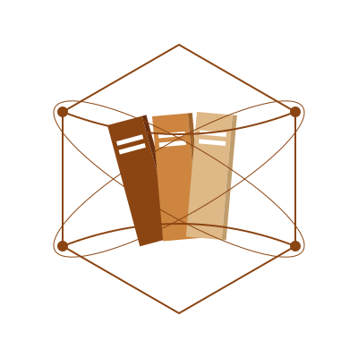

# Biblionix

## Contexte du Projet

Biblionix est une plateforme innovante dédiée à la gestion des livres dans une bibliothèque. Ce système permet aux utilisateurs (bibliothécaires, administrateurs, membres, et écrivains) de consulter, rendre et gérer des livres de manière fluide et efficace. Notre passion pour la gestion de l'information et des ressources éducatives est la source d'inspiration de ce projet.

### Images du Projet

.jpg>)

.jpg>)
.jpg>)

## User Stories

### Visiteur 👤
- 🔐 En tant que Visiteur, je peux créer un compte afin de m’inscrire et accéder aux fonctionnalités réservées aux membres 🎉.
- 📚 En tant que Visiteur, je peux afficher les livres disponibles 📖.
- 🔍 En tant que Visiteur, je peux rechercher et filtrer les livres disponibles 📚.

### Lecteur 📖
- 🔐 En tant que Lecteur, je peux me connecter 🖥️.
- 🚪 En tant que Lecteur, je peux me déconnecter 🔒.
- 📚 En tant que Lecteur, je peux afficher les livres disponibles 📖.
- 🔍 En tant que Lecteur, je peux rechercher et filtrer les livres disponibles 📚.
- ℹ️ En tant que Lecteur, je peux afficher les informations d’un livre 📖.
- 📅 En tant que Lecteur, je peux réserver un livre afin de m’assurer qu’un livre sera disponible pour moi à une date ultérieure ⏳.
- 📋 En tant que Lecteur, je peux afficher mes réservations 📅.
- ❌ En tant que Lecteur, je peux annuler mes réservations.
- 🆗 En tant que Lecteur, je peux prolonger mes réservations 🕒.
- 🔍 En tant que Lecteur, je peux ajouter des reviews sur les livres ou les écrivains 📚.
- 🔍 En tant que Lecteur, je peux afficher et rechercher les écrivains existants dans le site 🤵‍♂️.

### Auteur ✍️
- 🔐 En tant que Auteur, je peux me connecter 🖥️.
- 🚪 En tant que Auteur, je peux me déconnecter 🔒.
- 📚 En tant que Auteur, je peux afficher les livres disponibles 📖.
- 🔍 En tant que Auteur, je peux rechercher et filtrer les livres disponibles 📚.
- ℹ️ En tant que Auteur, je peux afficher les informations d’un livre 📖.
- 📅 En tant que Auteur, je peux réserver un livre afin de m’assurer qu’un livre sera disponible pour moi à une date ultérieure ⏳.
- 📋 En tant que Auteur, je peux afficher mes réservations 📅.
- ❌ En tant que Auteur, je peux annuler mes réservations.
- 🆗 En tant que Auteur, je peux prolonger mes réservations 🕒.
- 🔍 En tant que Auteur, je peux ajouter des reviews sur les livres ou les écrivains 📚.
- 🔍 En tant que Auteur, je peux afficher et rechercher les écrivains existants dans le site 🤵‍♂️.
- 📚 En tant que Auteur, je peux ajouter un livre 🌍.

### Bibliothécaire 📚
- 🔐 En tant que Bibliothécaire, je peux me connecter afin d’accéder aux fonctionnalités de gestion de la bibliothèque avec des permissions adaptées 🖥️.
- 🚪 En tant que Bibliothécaire, je peux me déconnecter afin de protéger les données sensibles après utilisation 🔒.
- 📚 En tant que Bibliothécaire, je peux ajouter un livre afin d’enrichir le catalogue de la bibliothèque 🏛️.
- 🗑️ En tant que Bibliothécaire, je peux supprimer un livre afin de retirer un livre obsolète ou endommagé du catalogue 🚫.
- ✏️ En tant que Bibliothécaire, je peux modifier un livre afin de mettre à jour les informations d’un livre dans le système 📖.
- 📚 En tant que Bibliothécaire, je peux afficher les livres afin de vérifier le catalogue actuel de la bibliothèque 🏛️.
- 🆗 En tant que Bibliothécaire, je peux afficher les emprunts et leurs prolongements afin de suivre les livres empruntés et leurs dates de retour 🕒.
- ✍️ En tant que Bibliothécaire, je peux accepter ou refuser les réservations et les prolongements 🗂️.
- ⭐ En tant que Bibliothécaire, je peux afficher les avis des utilisateurs sur les livres et les écrivains 🌟.
- 🗑️ En tant que Bibliothécaire, je peux supprimer un avis 🚫.
- 📜 En tant que Bibliothécaire, je peux voir les statistiques générales du site 🗂️.

### Administrateur 🧑‍💼
- 🔐 En tant que Administrateur, je peux me connecter afin d’accéder aux fonctionnalités d’administration du système avec des permissions adaptées 🖥️.
- 🚪 En tant que Administrateur, je peux me déconnecter afin de sécuriser le système après utilisation 🔒.
- ⚙️ En tant que Administrateur, je peux modifier le statut de compte des utilisateurs afin de gérer les accès et les privilèges des utilisateurs 🔐.
- 🔍 En tant que Administrateur, je peux voir les utilisateurs et rechercher afin de consulter et gérer la liste des utilisateurs enregistrés 📋.
- ⚙️ En tant que Administrateur, je peux modifier le rôle des utilisateurs afin d’attribuer ou modifier les permissions des utilisateurs 🔐.
- 👤 En tant que Administrateur, je peux ajouter un utilisateur afin de créer de nouveaux comptes pour les utilisateurs ✍️.
- 🗑️ En tant que Administrateur, je peux supprimer un utilisateur afin de retirer un compte qui n’est plus nécessaire 🚫.
- 📜 En tant que Administrateur, je peux voir les statistiques générales du site 🗂️.
- 🏷️ En tant que Administrateur, je peux ajouter une catégorie afin d’organiser les livres par genre ou sujet 📚.
- 🗑️ En tant que Administrateur, je peux supprimer une catégorie afin de retirer une catégorie qui n’est plus utilisée 🚫.
- ✏️ En tant que Administrateur, je peux modifier une catégorie afin de mettre à jour les informations d’une catégorie 🏷️.
- 📜 En tant que Administrateur, je peux afficher les catégories afin de vérifier l’organisation actuelle des livres 🏷️.
- 📜 En tant que Administrateur, je peux afficher les utilisateurs afin de vérifier les comptes enregistrés dans le système 📋.
- 🏷️ En tant que Administrateur, je peux ajouter des tags 📚.
- 🗑️ En tant que Administrateur, je peux supprimer un tag 🚫.
- ✏️ En tant que Administrateur, je peux modifier un tag 🏷️.
- 📜 En tant que Administrateur, je peux afficher les tags 🏷️.
- 🏷️ En tant que Administrateur, je peux ajouter un badge 📚.
- 🗑️ En tant que Administrateur, je peux supprimer un badge 🚫.
- 📜 En tant que Administrateur, je peux afficher les badges et rechercher et filtrer les badges 🏷️.
- 📜 En tant que Administrateur, je peux afficher les transactions 🏷️.

## Diagrammes UML

- **Diagramme de Classes** (voir image attachée : uml-diagram.png)
- **Diagramme de Cas d'Utilisation** (voir image attachée : uml-diagram.png)

## Fonctionnalités

### 4-1 Présentation des Livres
- Chaque livre aura une fiche détaillée comprenant : Titre, auteur, date de publication, résumé, status livre, disponibilité.
- Possibilité de recherche par titre, auteur.

### 4-2 Inscription et Connexion
- Les utilisateurs doivent s'inscrire pour accéder aux fonctionnalités complètes.
- Formulaire d'inscription : nom, prénom, email, mot de passe.
- Connexion via nom d'utilisateur et mot de passe.

### 4-3 Gestion des Emprunts
- Les membres peuvent :
  - Emprunter des livres.
  - Consulter la liste de leurs emprunts en cours.
  - Annuler leurs réservations ou faire des prolongations.

### 4-4 Gestion des Livres (Bibliothécaires)
- Ajouter, modifier ou supprimer des livres du catalogue.
- Suivre la disponibilité des ouvrages.
- Gérer les réservations des utilisateurs.

### 4-5 Gestion des Utilisateurs (Administrateurs)
- Gérer les comptes utilisateurs (création, modification, suppression).
- Attribuer des rôles (membre, bibliothécaire, écrivain).
- Analyser les statistiques d'utilisation de la plateforme.

### 4-6 Soumission d'Ouvrages (Écrivains)
- Les écrivains peuvent soumettre leurs ouvrages pour inclusion dans le catalogue.

## Liens
- [GitHub](https://github.com/MhamedOuhanane/Fil-Rouge-Biblionix.git)
- [Présentation Canva](https://www.canva.com/design/DAGc76KOL5Q/w_73FeAmPJRnXo703s3LhA/edit?utm_content=DAGc76KOL5Q&utm_campaign=designshare&utm_medium=link2&utm_source=sharebutton)
- [Planification Jira](https://mhamde.atlassian.net/jira/software/projects/FRB/boards/13?atlOrigin=eyJpIjoiMTA2NmQ0MDdiYjdkNDQ2ZTliNmJkOGM0MDNiMmQ1MmUiLCJwIjoiaiJ9)
- [Design Figma](https://www.figma.com/design/mwUOccXtTpPT3F3xngbbg9/Fil-rouge-Biblionix?node-id=0-1&t=DLlvA7kWhVdjsWbc-1)
- [Cahier des Charges](https://docs.google.com/document/d/1Z0QCqOvI22yA6bOuHScoKChxntKI6MfydA3RD6_FhXc/edit?usp=sharing)